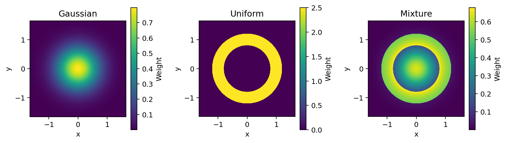
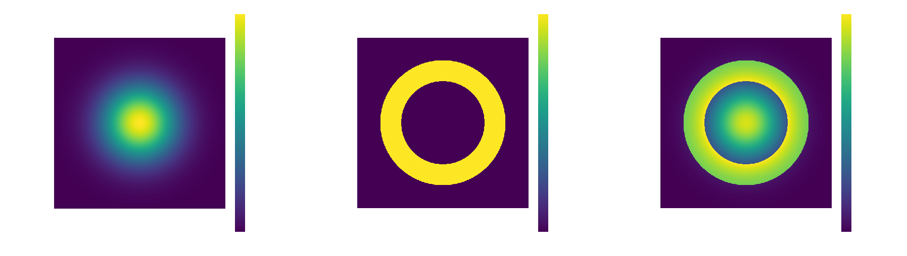

=============
Distributions
=============

:mod:`stablebear.distributions` provides Gaussian, Uniform, and Mixture
distributions. Their ``weight(values)`` methods evaluate weights for plotting
and sampling.

.. list-table:: Available distributions
   :header-rows: 1
   :widths: 20 35 45

   * - Distribution
     - Parameters
     - Constraints and conventions
   * - :class:`~stablebear.distributions.Gaussian`
     - ``mean=0``, ``sigma=1``
     - Finite mean and finite positive standard deviation.
   * - :class:`~stablebear.distributions.Uniform`
     - ``start=0``, ``end=1``
     - Interval ``[start, end)`` with ``start < end``.
       ``start=-inf`` and ``end=inf`` are allowed.
   * - :class:`~stablebear.distributions.Mixture`
     - ``distributions``, ``weights`` (both required)
     - Nonempty sequences of equal length. Components may include mixtures.
       Weights must be finite and nonnegative, with at least one positive;
       they are normalized and need not sum to one.

Parameters can be passed by position or by keyword::

   import stablebear as sb

   gaussian = sb.distributions.Gaussian(2.0, 0.3)
   uniform = sb.distributions.Uniform(start=1.0, end=2.0)

Evaluating weights
==================

Pass a scalar or an array of filter values to ``weight``::

   gaussian.weight(2.0)             # approximately 1.3298
   uniform.weight([0.5, 1.0, 1.5])   # array([0., 1., 1.])

Scalar input returns a float. Array-like input returns a float64 NumPy array
with the same shape, including multidimensional grids. Values must be finite
real numbers; negative filter values are accepted.

Gaussian weights are the normalized density
:math:`\exp(-\tfrac12((x-\mu)/\sigma)^2)/(\sigma\sqrt{2\pi})`.
A finite Uniform interval has density ``1 / (end - start)`` on ``[start, end)``
and zero elsewhere.

**Unbounded Uniform intervals are a special case:** they use weight one on
``[start, end)``. Either endpoint may be infinite; ``Uniform(-inf, inf)``
gives weight one everywhere. These weights do not integrate to one.

Mixture coefficients are normalized at construction and stored in ``weights``.
Evaluation combines component weights using these fixed coefficients::

   mixture = sb.distributions.Mixture([gaussian, uniform], [1, 3])
   mixture.weights  # (0.25, 0.75)
   weights = mixture.weight([0.5, 1.0, 1.5])

Each value is evaluated independently, so changing the grid or evaluating one
value at a time does not change the result. A mixture of normalized densities
is itself normalized. A positive-weight unbounded Uniform component, including
one in a nested mixture, carries the unbounded-interval exception into the
mixture.

For sampling, the combined weights are normalized over the reference points
once. Components are not individually normalized over those points.

Heatmaps
========

:func:`~stablebear.plotting.plot_distance_weight_heatmap` creates a grid and plots
weights against distance from ``query``, which defaults to the origin.
Pass ``ax`` to draw on an existing Matplotlib axes. The helper chooses bounds
automatically from ``distribution.plot_range()``: Gaussian uses
``mean ± 3*sigma``, Uniform uses its interval, and Mixture spans its
positive-weight components. The heatmap is centered on ``query`` and includes
a 10% margin. Unbounded ranges require an explicit ``extent``.

Use ``extent=(xmin, xmax, ymin, ymax)`` to override the bounds and ``resolution``
to set the number of pixels per axis (default 512). The helper returns a
Matplotlib image for adding a colorbar or adjusting the color scale. Each panel below has its
own color scale. The colors show distribution weights evaluated at distances,
not a probability density over the plane.

.. dropdown:: Show code
   :color: secondary

   .. literalinclude:: _static/gen_weight_function_fig.py
      :language: python
      :start-after: docs snippet start weight_heatmaps --
      :end-before: docs snippet end weight_heatmaps --

   .. code-block:: python

      fig = plot_weight_heatmaps()
      plt.show()

For constructor parameters, see :doc:`api_distributions`.
