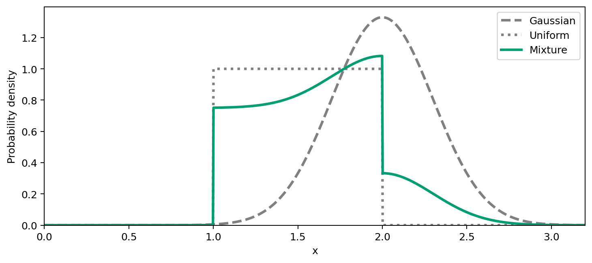
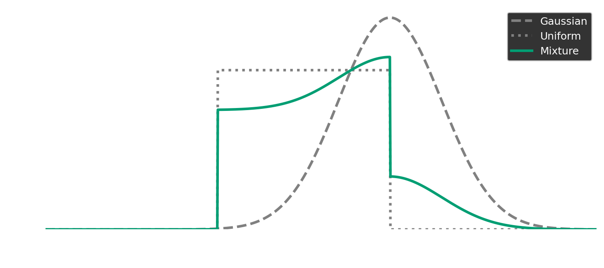

=============
Distributions
=============

:mod:`stablebear.distributions` provides Gaussian, Uniform, and Mixture
distributions, all instances of :class:`~stablebear.distributions.Distribution`.

.. list-table:: Available distributions
   :header-rows: 1
   :widths: 20 35 45

   * - Distribution
     - Parameters
     - Constraints and conventions
   * - :class:`~stablebear.distributions.Gaussian`
     - ``mean=0``, ``std=1``
     - Finite mean and finite positive standard deviation.
   * - :class:`~stablebear.distributions.Uniform`
     - ``start=0``, ``end=1``
     - Interval ``[start, end)`` with ``start < end``.
       ``start=-inf`` and ``end=inf`` are allowed.
       With either endpoint infinite, this defines a weighting function,
       not a probability distribution.
   * - :class:`~stablebear.distributions.Mixture`
     - ``distributions``, ``coefficients`` (both required)
     - Nonempty sequences of equal length. Components may include mixtures.
       Mixing coefficients must be finite and nonnegative, with at least one
       positive. They are normalized to sum to one at construction.

Parameters can be passed by position or by keyword::

   import stablebear as sb

   gaussian = sb.distributions.Gaussian(2.0, 0.3)
   uniform = sb.distributions.Uniform(start=1.0, end=2.0)
   mixture = sb.distributions.Mixture(
       [gaussian, uniform],
       coefficients=[0.25, 0.75],  # Need not sum to one; normalized automatically.
   )

The probability densities of these three distributions can be plotted using
``weight`` (see :ref:`distributions-evaluating-weights` for details).

.. dropdown:: Show code
   :color: secondary

   .. literalinclude:: _static/gen_distribution_density_fig.py
      :language: python
      :start-after: docs snippet start distribution_densities --
      :end-before: docs snippet end distribution_densities --

   .. code-block:: python

      fig = plot_distribution_densities()
      plt.show()

The solid curve combines 25% of the Gaussian density (dashed) and 75% of the
Uniform density (dotted). Here, all three curves integrate to one. For an
unbounded Uniform interval, ``weight`` defines a weighting function rather
than a probability density.

.. _distributions-evaluating-weights:

Evaluating weights
==================

Pass a scalar or an array of values to
:meth:`weight <stablebear.distributions.Distribution.weight>` to evaluate
weights::

   gaussian.weight(2.0)              # approximately 1.3298
   uniform.weight([0.5, 1.0, 1.5])   # array([0., 1., 1.])

Scalar input returns a float. Array-like input returns a float64 NumPy array
with the same shape, including multidimensional grids. Values must be finite
real numbers.

When the distribution represents a probability distribution, ``weight``
evaluates its probability density. This includes Gaussian and bounded Uniform
distributions, as well as mixtures of these distributions.

**Unbounded Uniform intervals are a special case:** they use weight one on
``[start, end)``. Either endpoint may be infinite; ``Uniform(-inf, inf)``
gives weight one everywhere. These weights do not integrate to one, so an
unbounded Uniform represents a weighting function, not a probability
distribution. The same exception applies to mixtures containing an unbounded
Uniform component with a positive coefficient, including nested mixtures.
