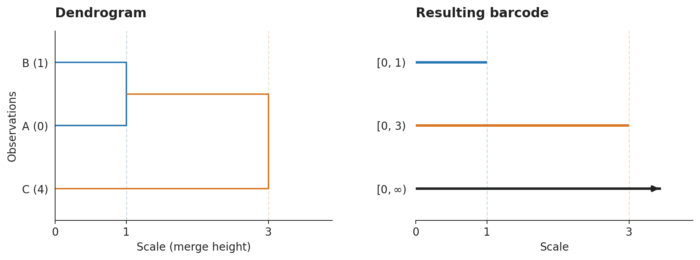
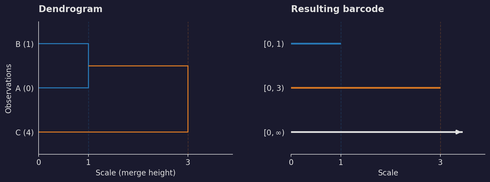
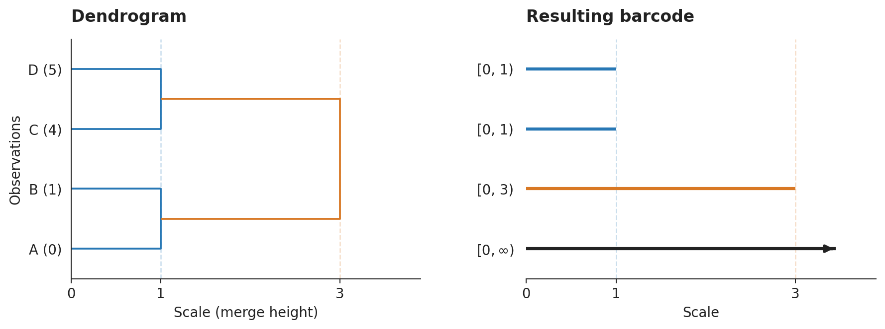
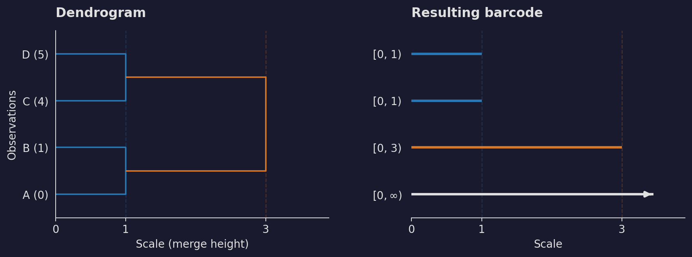

=================================
Converting SciPy linkage matrices
=================================

Use ``linkage_to_barcode`` to turn an existing hierarchical clustering result
into a single ``Barcode``::

   from scipy.cluster.hierarchy import linkage
   from stablebear.persistence import linkage_to_barcode

   Z = linkage([[0.0], [1.0], [4.0]], method="single")
   bc = linkage_to_barcode(Z)
   # Intervals: [0, 1), [0, 3), [0, inf).
   reduced_bc = linkage_to_barcode(Z, reduced=True)
   # Intervals: [0, 1), [0, 3).

Only the clustering step requires SciPy. ``linkage_to_barcode`` converts the
merges already recorded in ``Z``; it does not recompute the clustering.

Reading a dendrogram as a barcode
==================================

A :term:`dendrogram` draws the clustering as a tree. In the figures below,
read it from left to right: observations start at scale zero, and each
vertical join marks the scale at which two clusters become one. Both panels
use the same scale increasing to the right. The barcode records these reductions in
the number of clusters. All bars start at zero, and one bar ends at each
merge height. One bar continues forever because a single cluster remains
after all the merges. For now, assume the merge heights are positive and
nondecreasing.

Three observations, two merges
-------------------------------

The example above uses single linkage on three points on a line:
``A = 0``, ``B = 1``, and ``C = 4``. First, A and B merge at height 1.
Their cluster then merges with C at height 3, the distance from B to C.
The two finite barcode intervals therefore end at 1 and 3. Matching colors
in the figure connect each merge height to its bar endpoint.

.. dropdown:: Show code
   :color: secondary

   .. literalinclude:: _static/gen_linkage_figs.py
      :language: python
      :start-after: docs snippet start linkage_plot --
      :end-before: docs snippet end linkage_plot --

   .. literalinclude:: _static/gen_linkage_figs.py
      :language: python
      :start-after: docs snippet start linkage_three_points --
      :end-before: docs snippet end linkage_three_points --

   .. code-block:: python

      plot_three_points()
      plt.show()

At any scale, count the bars that have not yet ended to recover the number
of clusters. Here there are three clusters below 1, two from 1 up to
(but not including) 3, and one from 3 onwards. The finite intervals exclude their right endpoints:
at a merge height, the merge has already happened and the corresponding
bar is no longer present.

Several merges at the same height
----------------------------------

Now add a fourth point, ``D = 5``. A and B merge at height 1, and so do C
and D. The two pairs merge at height 3. This produces **two copies** of
``[0, 1)``, followed by ``[0, 3)`` and ``[0, inf)``. Equal merge heights
therefore appear as repeated intervals; they are not combined into a
single bar.

.. dropdown:: Show code
   :color: secondary

   .. literalinclude:: _static/gen_linkage_figs.py
      :language: python
      :start-after: docs snippet start linkage_plot --
      :end-before: docs snippet end linkage_plot --

   .. literalinclude:: _static/gen_linkage_figs.py
      :language: python
      :start-after: docs snippet start linkage_tied_merges --
      :end-before: docs snippet end linkage_tied_merges --

   .. code-block:: python

      plot_tied_merges()
      plt.show()

At height 1 the number of clusters drops from four to two, so two bars
end together. Although the linkage matrix records these as two separate
rows, both merges take place at the same scale.

In either example, ``reduced=True`` removes just the infinite interval.
The finite bars and their endpoints stay the same. The barcode records
when the cluster count drops, but does not retain which observations
merged: different trees can have the same barcode. Its rows are intervals,
not labels for particular observations.

Input and validation
=====================

Input must be an ``(n - 1, 4)`` NumPy array with float32 or float64 precision,
which is preserved in the output. The input is not modified. Empty ``(0, 4)``
input represents a single observation, producing one infinite interval (or an
empty barcode in reduced mode). Invalid cluster references or counts, non-finite
entries, and negative heights raise ``ValueError``.

Zero-length intervals are omitted: observations that merge at height zero
are already together at the starting scale. Conversion preserves the input
clustering and its tie-breaking choices, and validation and conversion run
in C++ with the Python GIL released.

Non-monotone merge heights
===========================

Inversions, such as those from centroid or median linkage, are handled by
delaying each parent merge until both child clusters exist. Its effective
height is the maximum of its supplied height and its children's effective
heights. For example, child merges at 3.0 and 3.5 followed by a parent merge
at 3.25 produce finite bars ending at 3.0, 3.5, and 3.5. Heights are not
sorted, and unrelated branches do not delay one another.

Conversion emits one ``UserWarning`` when input merge heights are non-monotone:
a row's height is lower than the preceding row's height. This includes decreases
on independent branches, even when no parent height needs adjustment. Equal
heights are allowed and do not trigger a warning.

Mathematical background
=======================

Linkage distances and merge heights
-----------------------------------

Let :math:`X` be a finite set of observations with a distance
:math:`d : X \times X \to [0,\infty)`. Choose a linkage rule :math:`\psi`
that extends :math:`d` to a distance :math:`\psi d` between nonempty subsets
of :math:`X`, with

.. math::

   \psi d(\{x\},\{y\}) = d(x,y).

For example, single linkage uses
:math:`\psi d(A,B)=\min_{x\in A,\,y\in B}d(x,y)`. For distinct clusters,
complete linkage uses the maximum of these distances, and average linkage
uses their arithmetic mean.

Starting with one cluster per observation, hierarchical clustering
repeatedly joins a pair of current clusters :math:`A,B` attaining the
smallest current linkage distance :math:`\psi d(A,B)`, resolving ties
according to a tie-breaking rule. Each join is recorded as one row of the
linkage matrix. The *merge height* is this distance:

.. math::

   h = \psi d(A,B).

It is recorded in the third column of the corresponding linkage row.
Assume throughout this explanation that these merge heights are
nondecreasing. The resulting :term:`dendrogram` is also called the
:math:`\psi` linkage of :math:`d` and denoted by :math:`\psi d`;
we write :math:`D` for this dendrogram below. The linkage matrix specifies
the chosen pair at each merge, including any tie-breaking choices.

.. _linkage-cluster-transitions:

Clusters and transition maps
----------------------------

A linkage matrix describes a dendrogram: a family of partitions of
:math:`X`, indexed by a scale :math:`t \geq 0`. To describe
these partitions in terms of distances between points, let :math:`u(x,y)`
be the merge height at which observations :math:`x` and :math:`y` first
belong to the same cluster, with :math:`u(x,x)=0`. This is the distance
induced by the dendrogram. Define

.. math::

   x \sim_t y \quad\Longleftrightarrow\quad u(x,y) \leq t,
   \qquad D_t = X/{\sim_t}.

Here :math:`X/{\sim_t}` is the partition of :math:`X` induced by the
equivalence relation :math:`\sim_t`: its blocks are the equivalence classes
of observations that have merged by scale :math:`t`. The induced distance satisfies
:math:`u(x,z) \leq \max\{u(x,y),u(y,z)\}`, so this relation is transitive.
Distinct observations may have distance zero if they merge at height zero.

For single linkage, this has an equivalent description directly in terms
of the distance :math:`d`: observations
:math:`x` and :math:`y` belong to the same cluster in :math:`D_t` if there
is a chain :math:`x=x_0,x_1,\ldots,x_k=y` with
:math:`d(x_i,x_{i+1}) \leq t` for every consecutive pair. Their direct
distance :math:`d(x,y)` can therefore exceed :math:`t`. For other linkage
methods, use the induced distance :math:`u`; this chain description in
terms of the original input distances need not apply.

For :math:`s \leq t`, every cluster at scale :math:`s` lies in a
unique cluster at scale :math:`t`, giving a transition map

.. math::

   D_{s \leq t} : D_s \longrightarrow D_t,
   \qquad C \longmapsto \text{the cluster containing } C.

This map is :term:`surjective <surjective map>` because every cluster at scale :math:`t` is a union
of clusters at scale :math:`s`, so every target cluster has a
:term:`preimage`.

These maps satisfy :math:`D_{t \leq t} = \mathrm{id}` and
:math:`D_{r \leq t} = D_{s \leq t} \circ D_{r \leq s}` for
:math:`r \leq s \leq t`: following clusters through an intermediate scale
has the same result as mapping directly to the final scale. Equivalently,
the diagrams

.. container:: tikz-diagram

   .. tikz::
      :include: _static/linkage_transitions.tex
      :align: center
      :alt: On the left, a straight transition arrow and a curved identity arrow both map D_t to itself; on the right, the map from D_r to D_t equals the composition through D_s.

commute.

From clusters to vector spaces
------------------------------

Fix a field :math:`K`. The vector spaces
:term:`freely generated by <freely generated vector space>` the cluster sets,
together with the linear maps induced by the cluster transitions, are

.. math::

   V_t = K D_t = \bigoplus_{C\in D_t} K e_C,
   \qquad
   V_{s\leq t} = K D_{s\leq t} : V_s \longrightarrow V_t,
   \qquad e_C \longmapsto e_{D_{s\leq t}(C)}.

Thus :math:`\dim_K V_t=|D_t|`, and the linear maps satisfy the same
identity and composition relations as the set maps in the
:ref:`previous subsection <linkage-cluster-transitions>`. For a walkthrough of
the direct sum notation, basis vectors, and linear extension, see
:ref:`linkage-linear-algebra-appendix`.

The family :math:`V_t`, together with its transition maps, is a *tame vector space parametrized
by* :math:`[0,\infty)`, also called a persistence module: its vector spaces
are finite dimensional and change only at the finitely many merge heights.

A filtration and its zeroth homology
------------------------------------

To interpret this module as homology, construct an (abstract)
:term:`simplicial complex`
:math:`\mathcal{F}_t` at each scale by filling in a simplex on each cluster:

.. math::

   \mathcal{F}_t = \bigcup_{C\in D_t} \Delta(C).

Here :math:`\Delta(C)` has the observations in :math:`C` as its vertices.
Every nonempty subset forms a simplex: each pair spans an edge, each triple
a filled triangle, and so on. Thus
the connected components of :math:`\mathcal{F}_t` are exactly the clusters
in :math:`D_t`. Since clusters only merge as the scale increases,
:math:`\mathcal{F}_s\subseteq\mathcal{F}_t` for :math:`s\leq t`.
This nested family of complexes is a *filtration*.

Zeroth homology is

.. math::

   H_0(\mathcal{F}_t;K)
   = \ker\partial_0 / \operatorname{im}\partial_1.

Here :math:`\partial_0=0`, so

.. math::

   \ker\partial_0 = C_0(\mathcal{F}_t;K) = KX.

The chain group :math:`C_0(\mathcal{F}_t;K)` has one basis vector
:math:`e_x` per vertex of :math:`\mathcal{F}_t`, and these vertices are
exactly the observations in :math:`X`. The boundary of an edge from
:math:`x` to :math:`y` is :math:`e_y-e_x`. Thus
:math:`\operatorname{im}\partial_1` is spanned by these differences for
observations in the same cluster. Taking the quotient sets those
differences to zero: all observation vectors within a cluster become the
same class, leaving one independent class per cluster. Hence

.. math::

   H_0(\mathcal{F}_t;K) \cong K D_t = V_t.

For :math:`s\leq t`, the inclusion
:math:`\iota_{s\leq t}:\mathcal{F}_s\hookrightarrow\mathcal{F}_t` keeps
each vertex :math:`x` unchanged, so its map on zeroth chain groups is
:math:`e_x\mapsto e_x`. Every edge present at scale :math:`s` is still
present at scale :math:`t`, so every boundary relation at scale :math:`s`
also holds at scale :math:`t`. Consequently, this map passes to the
quotients defining homology:

.. math::

   H_0(\iota_{s\leq t};K):H_0(\mathcal{F}_s;K)
   \longrightarrow H_0(\mathcal{F}_t;K),
   \qquad [v]_s\longmapsto[v]_t.

Here :math:`[v]_s` and :math:`[v]_t` denote the classes of the same vector
:math:`v\in KX` modulo the boundary relations at the respective scales.
The rule is well-defined because vectors representing the same class at
scale :math:`s` still represent the same class at scale :math:`t`.
In terms of clusters, two observations that belong to the same cluster at
scale :math:`s` remain in the same cluster at scale :math:`t`. That cluster
may now contain additional observations after merging with other clusters,
but observations already together never become separated.
Under :math:`H_0(\mathcal{F}_t;K)\cong K D_t`, this is exactly
:math:`V_{s\leq t}`: the class of an observation in an earlier cluster
maps to the class of the later cluster containing it.
Thus the vector spaces and transition maps together form the :math:`H_0`
persistence module of this filtration.

What happens at a merge
-----------------------

Between merge events, the clusters remain unchanged, so the transition
maps are :term:`isomorphisms <isomorphism>`. If a merge occurs in
:math:`(s,t]`, however, the transition :math:`V_{s\leq t}` sends distinct
basis vectors to the same target basis vector and adds their coefficients.
The map remains surjective, but is no longer
:term:`injective <injective map>` (one-to-one), so it is not an isomorphism. The dimension drops by one for each binary merge
in :math:`(s,t]`.

For example, when two clusters :math:`A` and :math:`B` merge into
:math:`C`, the transition sends both :math:`e_A` and :math:`e_B` to
:math:`e_C`. On these coordinates it is the map

.. math::

   K^2 \longrightarrow K, \qquad (a,b) \longmapsto a+b.

The difference :math:`e_A-e_B` maps to zero, so one independent class dies.
All transitions are surjective: merging clusters introduces no new classes.

From the persistence module to a barcode
----------------------------------------

A bar :math:`[a,b)` represents the parametrized vector space

.. math::

   K_{[a,b)}(t) =
   \begin{cases}
      K, & a \leq t < b, \\
      0, & \text{otherwise},
   \end{cases}

with identity transitions while both scales lie in the interval and zero
transitions otherwise. A tame persistence module decomposes as a :term:`direct sum <direct sum of vector spaces>`
of such bars, uniquely up to their order. Since all transition maps here
are surjective, no new classes appear at positive scales, so every bar is
born at zero. For a linkage matrix this gives

.. math::

   V \cong K_{[0,\infty)} \oplus
      \bigoplus_{\substack{v\text{ a merge} \\ h(v)>0}} K_{[0,h(v))}.

Here :math:`h(v)` is the height recorded for merge :math:`v` in the linkage
matrix. Each positive merge height contributes a finite bar,
including multiplicities when several merges occur at the same height.
Merges at zero are already reflected in :math:`D_0` and contribute no
nonempty interval. The final cluster accounts for the single infinite bar.
``linkage_to_barcode`` returns precisely this multiset of intervals; the
result is independent of the choice of field :math:`K`.

Reduced homology
----------------

Reduced homology is defined by extending the chain complex one degree
further: add :math:`C_{-1}=K` and replace the zero boundary map out of
:math:`C_0(\mathcal{F}_t;K)` with the *augmentation map*, which adds the
vertex coefficients:

.. math::

   \cdots \xrightarrow{\partial_2} C_1(\mathcal{F}_t;K)
   \xrightarrow{\partial_1} C_0(\mathcal{F}_t;K)
   \xrightarrow{\varepsilon_t} K \longrightarrow 0,
   \qquad
   \varepsilon_t\left(\sum_{x\in X} a_x e_x\right)=\sum_{x\in X} a_x.

An edge boundary :math:`e_y-e_x` has coefficient sum zero, so
:math:`\varepsilon_t\partial_1=0`, as required for a chain complex.
The definition of homology therefore gives

.. math::

   \widetilde H_0(\mathcal{F}_t;K)
   = \ker\varepsilon_t / \operatorname{im}\partial_1.

This construction can also be expressed using the cluster vector space
:math:`H_0(\mathcal{F}_t;K)\cong V_t=K D_t`. Since boundaries have
coefficient sum zero, the augmentation is well-defined on ordinary
homology classes and gives a map

.. math::

   \overline\varepsilon_t:V_t\longrightarrow K,
   \qquad \sum_{C\in D_t} a_C e_C\longmapsto\sum_{C\in D_t} a_C.

Its :term:`kernel <kernel of a linear map>` consists of the classes
represented by chains with coefficient sum zero. Hence

.. math::

   \widetilde H_0(\mathcal{F}_t;K)
   \cong \widetilde V_t := \ker\overline\varepsilon_t
   = \left\{\sum_{C\in D_t} a_C e_C : \sum_{C\in D_t} a_C=0\right\}.

For two clusters :math:`A,B`, every reduced class has the form
:math:`a(e_A-e_B)`. When the clusters merge, both basis vectors map to
the same vector, so their difference maps to zero. Once only one cluster
remains, the only vector with coefficient sum zero is the zero vector.
Thus ordinary :math:`H_0` has one independent class per cluster, while
reduced :math:`H_0` has dimension :math:`|D_t|-1`: it counts the number of
clusters beyond one.

Transition maps add the coefficients of merging clusters, preserving their
total sum. They therefore send :math:`\widetilde V_s` into
:math:`\widetilde V_t`, giving the reduced persistence module. Its barcode
has the same finite bars as ordinary :math:`H_0`, with the single
:math:`[0,\infty)` bar removed. This is what
``linkage_to_barcode(Z, reduced=True)`` returns.

.. _linkage-linear-algebra-appendix:

Appendix: vector spaces and linear maps
---------------------------------------

To obtain vector spaces and linear maps, fix a field :math:`K`, which
specifies the allowed coefficients (for example, :math:`K=\mathbb{R}`
allows real coefficients). Assign a :term:`basis <basis of a vector space>`
vector :math:`e_C` to each cluster :math:`C\in D_t`. The vector space
freely generated by these clusters
is written

.. math::

   V_t = K D_t = \bigoplus_{C \in D_t} K e_C.

Here :math:`K D_t` denotes the vector space generated by the set
:math:`D_t`, and :math:`K e_C = \{a e_C : a\in K\}` is the one-dimensional
space of scalar multiples of :math:`e_C`. The symbol :math:`\bigoplus`
denotes a :term:`direct sum <direct sum of vector spaces>`: we take one
independent copy of :math:`K` for each cluster. Thus every vector in
:math:`V_t` has a unique expression

.. math::

   v = \sum_{C\in D_t} a_C e_C, \qquad a_C\in K.

In other words, a vector assigns one coefficient to each cluster. If
:math:`D_t=\{A,B,C\}`, then :math:`v=a_Ae_A+a_Be_B+a_Ce_C` corresponds
to the coordinate triple :math:`(a_A,a_B,a_C)\in K^3`. This explains why
:math:`\dim_K V_t=|D_t|`: the dimension is the number of clusters.

The cluster map :math:`D_{s\leq t}` induces a linear map by sending each
basis vector to the basis vector of its containing cluster:

.. math::

   V_{s \leq t} = K D_{s \leq t} : V_s \longrightarrow V_t,
   \qquad e_C \longmapsto e_{D_{s \leq t}(C)}.

The notation :math:`K D_{s\leq t}` means the linear extension of the
set map :math:`D_{s\leq t}`. To apply it to any vector, apply the rule to
each basis vector and keep its coefficient:

.. math::

   V_{s\leq t}\left(\sum_{C\in D_s} a_C e_C\right)
   = \sum_{C\in D_s} a_C e_{D_{s\leq t}(C)}.

When several clusters map to the same cluster, their coefficients add.
These linear maps satisfy the same identity and composition relations as
the set maps.
