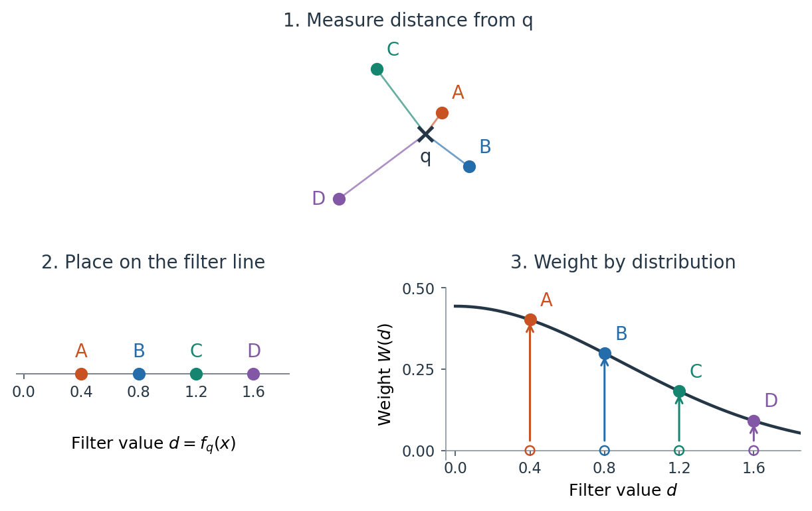
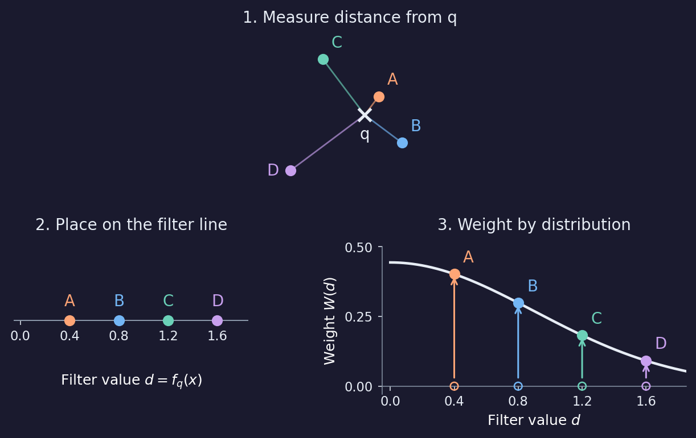
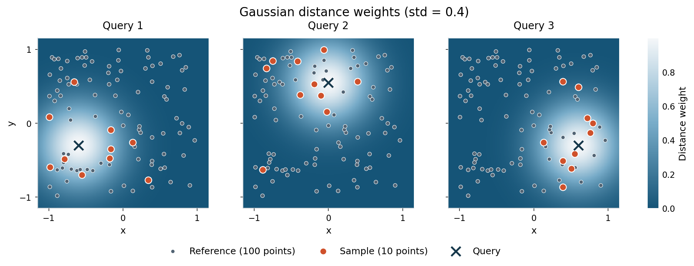
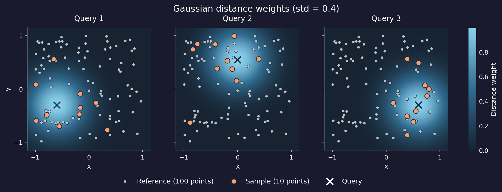
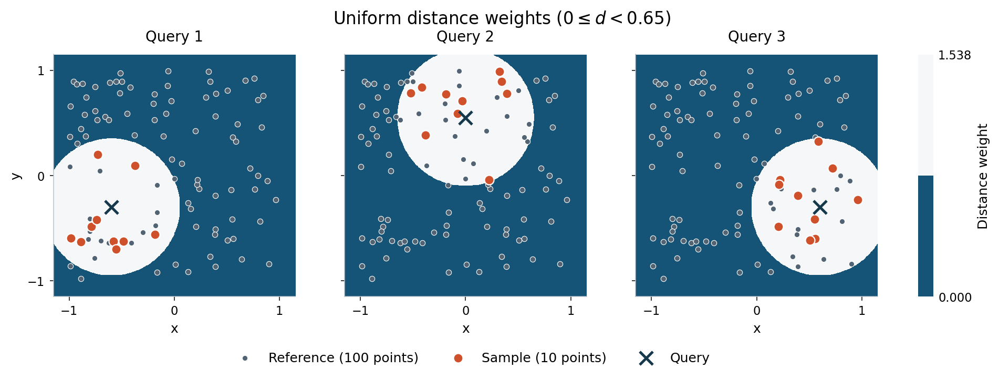
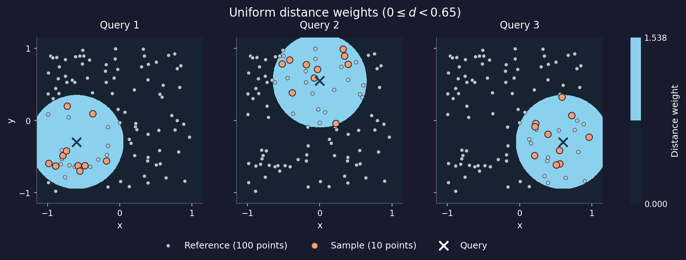

====================
Relative subsampling
====================

Relative subsampling starts with two datasets: a **reference dataset**
:math:`\mathcal{R}`, from which points are sampled, and a **query dataset**
:math:`\mathcal{Q}`. We draw samples from :math:`\mathcal{R}` for each query
point :math:`q \in \mathcal{Q}`. The two datasets live in the same
space, but neither needs to be a subset of the other. In practice, however,
the two datasets are often the same set, or the query dataset is a subset of
the reference dataset.

:func:`~stablebear.random.subsample_relative` implements the relative
construction of Agerberg, Chachólski, and Ramanujam :footcite:`Agerberg2023`,
with additional sampling options.

For uniform sampling, see :doc:`subsampling`. For the underlying data
representations, see :ref:`point-clouds-and-distance-matrices`. Shared sampling
options are documented in :doc:`subsampling_options`.

Filter functions and weights
============================

We assign a **filter function** :math:`f_q \colon \mathcal{R} \to \mathbb{R}` to
each query point :math:`q \in \mathcal{Q}`.
This function assigns a scalar value :math:`f_q(x)` to each reference point
:math:`x \in \mathcal{R}`. When
:math:`\mathcal{Q}, \mathcal{R} \subseteq \mathbb{R}^n`, the simplest choice is
the Euclidean distance :math:`f_q(x) = \lVert x - q \rVert_2` from the query
point. A **weight function**
:math:`W \colon \mathbb{R} \to [0, \infty)` then maps that value to a nonnegative
sampling weight:

.. math::

   w_q \colon \mathcal{R} \to [0, \infty), \qquad w_q(x) = W(f_q(x)).

**Currently, stablebear only supports distance filtering**,
:math:`f_q(x) = d(q, x)`: Euclidean distance
for a point cloud, or the stored pairwise distance for a distance matrix. 
For additional examples of filter functions, see Agerberg et al.
:footcite:`Agerberg2023`.

See :doc:`distributions` for the available weight functions and their
parameters.

The figure below follows four reference points from coordinates to filter
values and weights, using a
:class:`Gaussian <stablebear.distributions.Gaussian>` distribution.

ights.
   :figclass: only-light

ights.
   :figclass: only-dark

.. dropdown:: Show code
   :color: secondary

   .. literalinclude:: _static/gen_filter_function_fig.py
      :language: python
      :start-after: docs snippet start filter_function --
      :end-before: docs snippet end filter_function --

   .. code-block:: python

      fig = plot_filter_function()
      plt.show()

For the distance filter shown here, each point's distance from query ``q``
becomes its value on the one-dimensional **filter line**. Vertical arrows connect these filter values
to their ``Gaussian(0, 0.9)`` weights. Letters and colors identify the same
point in all three panels. Dividing the four weights by their sum gives the
sampling probabilities. Points close to ``q`` receive larger weights and are
more likely to be sampled.

Passing reference and query datasets
====================================

Pass the reference dataset as ``reference`` and specify the queries with
``query``. For point clouds ``R`` and ``Q``, the call is::

   import stablebear as sb
   from stablebear.distributions import Gaussian

   samples = sb.random.subsample_relative(
       reference=R,
       query=Q,
       distribution=Gaussian(std=0.5),
       n_points=10,   # Requested number of points per sample
       n_samples=5,   # Number of samples per query point
   )

``n_points`` sets the requested sample size; ``n_samples`` sets how many
independent samples to draw for each query point.
The result has shape ``(Q.shape[0], 5)``: five samples per query, with ten
points each. For example, one can loop over the queries and samples to print
the sampled points::

   import numpy as np

   for i in range(samples.shape[0]):
       for j in range(samples.shape[1]):
           sample = samples[i, j]
           
           print(f"Query {i}, sample {j}:")
           print(np.asarray(sample))
           
           assert sample.shape == (10, R.shape[1])

The ``query`` argument accepts these forms:

.. list-table::
   :header-rows: 1
   :widths: 40 60

   * - ``query``
     - Queries used
   * - ``Q`` (a :class:`~stablebear.point_cloud.PointCloud`,
       :class:`~stablebear.base_tensor.FloatTensor`, or coordinate array)
     - The rows of ``Q``, with shape ``(n_query, dimension)``.
   * - A one-dimensional integer list, array, or
       :class:`~stablebear.base_tensor.IntTensor`
     - The reference points at those indices, in the supplied order.
   * - ``None`` (or omitted)
     - Every reference point, in reference order.

For a :class:`~stablebear.distance_matrix.DistanceMatrix` reference, use index
queries or omit ``query``.
Query index ``i`` uses the stored distances ``D[i, j]`` to reference points
``j``. Each sample is a :term:`principal submatrix` in drawn index order, as in
:doc:`uniform subsampling <subsampling>`.

Choosing distributions
======================

See :doc:`distributions` for Gaussian and
:class:`~stablebear.distributions.Uniform` weight functions and
:class:`mixtures <stablebear.distributions.Mixture>`. For example::

   G = sb.distributions.Gaussian(std=0.5)
   U = sb.distributions.Uniform(start=1.0, end=2.0)
   mixture = sb.distributions.Mixture([G, U], coefficients=[0.3, 0.7])

A mixture is one distribution. Passing ``distribution=[G, U, mixture]`` requests
three separate sampling runs for each query and returns shape
``(n_query, 3, n_samples)``. Every nonempty list retains the distribution axis,
even a one-element list. A single distribution does not add an axis.

Queries change the selected region
==================================

We use a synthetic dataset of 100 reference points and
``Gaussian(0, 0.4)`` weights to compare samples at three query locations.

.. dropdown:: Show code
   :color: secondary

   .. literalinclude:: _static/gen_relative_subsampling_fig.py
      :language: python
      :start-after: docs snippet start relative_subsamples --
      :end-before: docs snippet end relative_subsamples --

Each cross marks a query, separate from the reference points shown as small
gray circles. Larger orange circles show one sample per query. Moving the
query shifts the region of larger weights and concentrates the sample near
its new location.

Lighter shading indicates larger Gaussian weights, with the same color scale
in every panel. These are weights evaluated at distances, not probabilities
over the plane; sampling normalizes the weights at the reference points only.

Uniform distance weights
========================

We now use ``Uniform(start=0, end=0.65)`` with the same reference point cloud
and queries, drawing ten points without replacement for each query.

.. dropdown:: Show code
   :color: secondary

   .. literalinclude:: _static/gen_relative_subsampling_fig.py
      :language: python
      :start-after: docs snippet start relative_subsamples --
      :end-before: docs snippet end relative_subsamples --

   .. code-block:: python

      fig = plot_relative_subsamples(uniform=True)
      plt.show()

The Uniform weights give a sharp cutoff: the light disk has weight
:math:`1 / 0.65 \approx 1.538` for distances ``0 <= d < 0.65``, and the
surrounding background has weight zero. Reference points inside each disk
have equal sampling weight. Points outside the disk will not be selected.

Sample size and count
=====================

``n_points`` is the positive number of draws requested per sample.
``n_samples`` is the positive number of samples generated for each
query/distribution pair, defaulting to one. Samples are independent, so a
reference point can appear in several samples (even when sampling without
replacement).

The sample axis follows the query and optional distribution axes:
``(n_query, n_samples)`` for a single distribution, or
``(n_query, n_distributions, n_samples)`` for a list. Empty and partial
samples retain those axes.

Eligible points and reporting
=============================

See :doc:`subsampling_options` for ``replace``,
``allow_partial``, ``discard_duplicates``, and
``generator``, as well as inspecting selected indices.

For relative subsampling, a reference point is eligible when it has positive
weight for a query/distribution pair. A point at infinite distance from the
query has zero weight for every distribution, including unbounded Uniform
distributions. Each pair is checked independently;
an error under ``allow_partial="no"`` identifies the failing pair.

Use ``replace=True, allow_partial="drop"`` to require a minimum number of
eligible points and draw with replacement, as in Step B1 of Agerberg et al.
:footcite:`Agerberg2023`.

If the query set is empty, the result has shape ``(0, n_samples)`` or
``(0, n_distributions, n_samples)``.

Persistence of relative subsamples
==================================

The :doc:`relative subsampling tutorial <tutorial_notebooks/relative_subsampling>`
shows the reference and query points, sampled point clouds, individual stable
ranks, and their averages. It averages over the sample axis while retaining the query,
distribution, and homology axes.

For a distance-matrix reference, the same pipeline starts with, for example,
``query=sb.indices([0, 5, 10])``. The returned
:class:`~stablebear.distance_matrix.DistanceMatrixTensor` has the same axis
conventions.

.. _relative-subsampling-heatmaps:

Heatmaps
========

Heatmaps help visualize how a distribution weights the nonnegative filter
values used by :func:`~stablebear.random.subsample_relative`. With distance
filtering, only the part of the distribution at nonnegative filter values
contributes; the part at negative values is discarded.

:func:`~stablebear.plotting.plot_distance_weight_heatmap` creates a grid and plots
weights against distance from ``query``, which defaults to the origin.
Pass ``ax`` to draw on an existing Matplotlib axes. The helper chooses bounds
automatically from ``distribution.plot_range()``. The heatmap is centered on
``query`` and includes a 10% margin.

Use ``extent=(xmin, xmax, ymin, ymax)`` to override the bounds and ``resolution``
to set the number of pixels per axis (default 512). The helper returns a
Matplotlib image for adding a colorbar or adjusting the color scale. Each panel below has its
own color scale. The colors show distribution weights evaluated at distances,
not a probability density over the plane.

.. image:: _static/weight_heatmaps_light.png
   :width: 100%
   :alt: Gaussian weights concentrated near the origin, Uniform weights on an annulus, and a mixture combining the two regions.
   :class: only-light

.. image:: _static/weight_heatmaps_dark.png
   :width: 100%
   :alt: Gaussian weights concentrated near the origin, Uniform weights on an annulus, and a mixture combining the two regions.
   :class: only-dark

.. dropdown:: Show code
   :color: secondary

   .. literalinclude:: _static/gen_weight_function_fig.py
      :language: python
      :start-after: docs snippet start weight_heatmaps --
      :end-before: docs snippet end weight_heatmaps --

   .. code-block:: python

      fig = plot_weight_heatmaps()
      plt.show()

References
==========

.. footbibliography::
