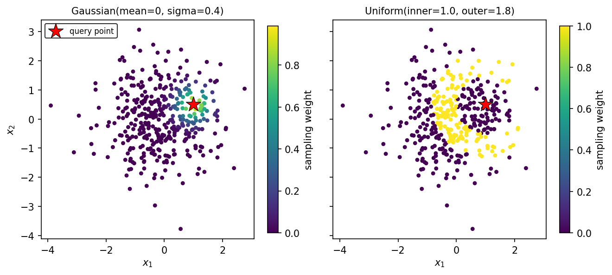
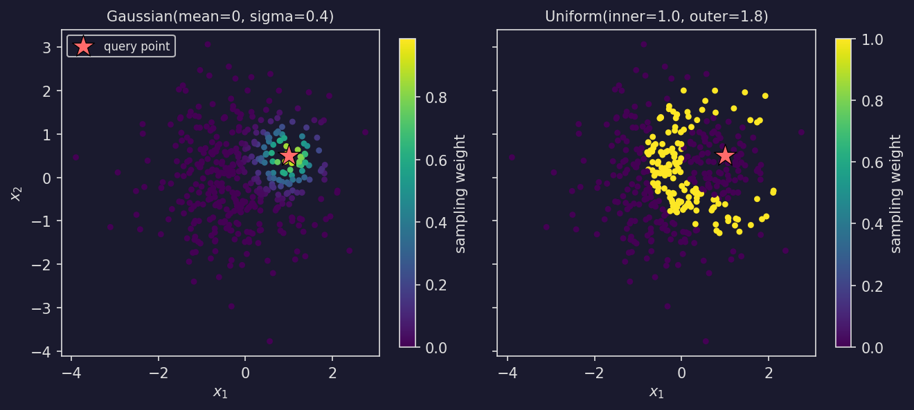

===========
Subsampling
===========

This guide covers :func:`~stablebear.sampling.subsample`, the front end of the
*relative approach* to topological data analysis of Agerberg, Chachólski &
Ramanujam :footcite:`Agerberg2023`. Subsampling turns a single reference point cloud into a tensor
of subsamples drawn *relative to* a set of query points, which then feeds
directly into the :doc:`persistent homology pipeline <persistence>`.

Background
==========

In the relative approach, the topology of a data set is probed *from the
viewpoint of* chosen query points. For each query point :math:`p` and the
reference point cloud :math:`R`, a probability over the reference points is
formed by applying a **filter** to each pair :math:`(p, r)` and passing the
result through a **distribution** :math:`D`:

.. math::

   \mathrm{prob}(r) \propto D\big(\mathrm{filter}(p, r)\big),\quad r \in R.

``n_instances`` subsamples of ``sample_size`` points each are then drawn from
:math:`R` according to that probability. With the default filter (Euclidean
distance) and a Gaussian distribution, this concentrates each query point's
subsamples on the reference points near it, so the persistent homology of those
subsamples describes the local shape of the data around that query point.

Quick example
=============

:func:`~stablebear.sampling.subsample` and the built-in distributions are
re-exported at the top level, so the common case needs a single import::

   import stablebear as sb
   import numpy as np

   reference = np.random.randn(500, 3)   # the data, shape (n_reference, dim)
   query     = np.random.randn(10, 3)    # 10 points to view it from

   # Default: Euclidean-distance filter + Gaussian(mean=0, sigma=1)
   subs = sb.subsample(reference, query, sample_size=30, n_instances=2000)

   print(subs.shape)      # (10, 2000)   -> one row of subsamples per query point
   print(subs[0, 0].shape) # (30, 3)     -> a single subsample is a point cloud

The result is a :class:`~stablebear.PointCloudTensor` of shape
``(n_query, n_instances)``; element ``[i, j]`` is the ``j``-th subsample (a
``(sample_size, dim)`` point cloud) drawn for query point ``i``.

If ``query`` is omitted, the reference cloud is used as its own set of query
points::

   subs = sb.subsample(reference, sample_size=30, n_instances=2000)
   # subs.shape == (500, 2000)

Reference and query points
===========================

``reference`` and ``query`` may each be a NumPy array, any array-like, or a
:class:`~stablebear.FloatTensor` of shape ``(n_points, dim)``. They must share
the same ambient dimension ``dim``. The dtype of the result follows the
reference: a ``float32`` reference produces ``pcloud32`` subsamples, a
``float64`` reference produces ``pcloud64``.

Filters
=======

The filter maps each ``(query point, reference cloud)`` pair to one value per
reference point. There are two ways to specify it:

**Built-in** ``"distance"`` **(the default).** Euclidean distance
:math:`\lVert p - r \rVert`, evaluated in parallel in C++::

   subs = sb.subsample(reference, query, sample_size=30, n_instances=2000,
                       filter_fn="distance")

**Custom callable.** A function ``filter_fn(p, reference) -> (n_reference,)``
that takes a single query point ``p`` (shape ``(dim,)``) and the full reference
array (shape ``(n_reference, dim)``) and returns one value per reference point.
For example, squared distance::

   def squared_distance(p, reference):
       return np.sum((reference - p) ** 2, axis=1)

   subs = sb.subsample(reference, query, sample_size=30, n_instances=2000,
                       filter_fn=squared_distance)

A custom filter is evaluated in Python (once per query point), so the built-in
``"distance"`` is preferred when it suffices.

Distributions
=============

The distribution maps filter values to non-negative sampling weights. Pass a
built-in spec or a callable via the ``distribution`` keyword; the default is
``Gaussian(mean=0.0, sigma=1.0)``.

The choice of distribution decides *which* reference points a query point is
likely to draw. The figure below colours each reference point by its sampling
weight for a single query point (the star): a small-``sigma`` Gaussian
concentrates the weight on the immediate neighbourhood, while a ``Uniform``
band gives equal weight to a shell at a fixed range of distances and zero
elsewhere.

.. dropdown:: Show code
   :color: secondary

   .. literalinclude:: _static/gen_plotting_gallery.py
      :language: python
      :start-after: docs snippet start subsample_weights --
      :end-before: docs snippet end subsample_weights --

Gaussian
--------

:class:`~stablebear.Gaussian` is an unnormalized Gaussian of the filter value,

.. math::

   D(v) = \exp\!\left(-\tfrac{1}{2}\left(\frac{v - \mu}{\sigma}\right)^2\right).

With the default distance filter, this concentrates sampling on reference points
whose distance to the query point is near :math:`\mu`. Sample close to each query
point with a small ``sigma`` around ``mean=0``, or focus on a shell at distance
:math:`\mu` by setting ``mean``::

   # Favour the immediate neighbourhood of each query point
   subs = sb.subsample(reference, query, sample_size=30, n_instances=2000,
                       distribution=sb.Gaussian(mean=0.0, sigma=0.5))

   # Favour reference points about distance 2 away
   subs = sb.subsample(reference, query, sample_size=30, n_instances=2000,
                       distribution=sb.Gaussian(mean=2.0, sigma=0.5))

Uniform
-------

:class:`~stablebear.Uniform` puts equal weight on every reference point whose
filter value lies in a band :math:`[\text{inner}, \text{outer}]` and zero weight
outside it. With the distance filter this samples uniformly from a region defined
by distance to the query point:

- a **disk** of radius :math:`r` -- ``Uniform(outer=r)``;
- an **annulus** between radii :math:`r_1` and :math:`r_2` --
  ``Uniform(inner=r1, outer=r2)``;
- the **whole** reference cloud -- ``Uniform()`` (the default ``inner=0``,
  ``outer=`` :math:`\infty`).

::

   subs = sb.subsample(reference, query, sample_size=30, n_instances=2000,
                       distribution=sb.Uniform(inner=1.0, outer=3.0))

.. note::

   **Plain uniform sampling does not depend on the query points.** With the
   default distance filter and a fully-open ``Uniform()`` (or any distribution
   that weights every reference point equally), the sampling probability is the
   same for every query point, so the ``n_query`` rows of the output are just
   independent draws from one identical distribution. Pass a **single** query
   point in that case (e.g. ``query=reference[:1]``) and raise ``n_instances``
   if you need more subsamples -- adding query points only multiplies redundant
   work.

   The one good reason to keep several query points under a uniform
   distribution is to **preserve the** ``(n_query, n_instances)`` **output
   shape** -- for instance to drop a uniform baseline into a pipeline that
   otherwise compares query-dependent distributions, without changing the
   tensor shapes the downstream code expects. (A *banded* ``Uniform(inner,
   outer)`` does depend on the query point, so this caveat applies only to the
   fully-open default.)

Custom callable
---------------

Any callable ``distribution(values) -> (n_reference,)`` returning non-negative
weights works too. ``values`` is the array of filter values for one query point.
For instance, a hard distance cutoff::

   subs = sb.subsample(reference, query, sample_size=30, n_instances=2000,
                       distribution=lambda v: (v < 2.0).astype(float))

The weights need not be normalized -- they are treated as relative
probabilities. ``subsample`` raises if any weight is negative, or if every
reference point gets weight zero for some query point.

.. note::

   When the filter is the built-in ``"distance"`` *and* the distribution is a
   built-in :class:`~stablebear.Gaussian` or :class:`~stablebear.Uniform`, the
   whole probability-and-draw computation runs in a single fused C++ pass. A
   custom filter or distribution falls back to computing weights in Python
   before drawing.

Drawing controls
================

- ``sample_size`` -- number of points in each subsample (``s`` in the paper).
- ``n_instances`` -- number of subsamples drawn per query point (``n`` in the
  paper). This becomes the second axis of the output tensor.
- ``replace`` -- whether each subsample is drawn with replacement. Default
  ``True`` (as in the paper).
- ``generator`` -- a :class:`stablebear.random.Generator` for reproducible
  draws. If omitted, the global generator is used. Passing a seeded generator
  makes the subsamples reproducible::

     g = sb.random.Generator(seed=0)
     subs = sb.subsample(reference, query, sample_size=30, n_instances=2000,
                         generator=g)

- ``verbose`` -- if ``True``, show a progress bar while the subsamples are drawn
  and allow cooperative cancellation (e.g. via ``KeyboardInterrupt``).

Feeding into persistent homology
=================================

Because ``subsample`` returns a :class:`~stablebear.PointCloudTensor`, its output
drops straight into the :doc:`persistent homology pipeline <persistence>`.
Computing persistent homology over the subsamples and averaging the resulting
stable ranks over the ``n_instances`` axis yields one **relative stable rank**
per query point::

   import stablebear as sb
   from stablebear import persistence

   reference = np.random.randn(500, 3)
   query     = np.random.randn(10, 3)

   subs = sb.subsample(reference, query, sample_size=30, n_instances=2000)
   # subs.shape == (10, 2000)

   bcs  = persistence.compute_persistent_homology(subs, max_dim=1)
   # bcs.shape == (10, 2000, 2)   -> H0 and H1 for every subsample

   srs  = persistence.barcode_to_stable_rank(bcs)
   # srs.shape == (10, 2000, 2)

   rel  = sb.mean(srs, dim=1)
   # rel.shape == (10, 2)   -> one relative stable rank per query point, per H_n

The averaging step over ``dim=1`` collapses the ``n_instances`` subsamples into
a single summary, so ``rel[i, n]`` is the mean :math:`H_n` stable rank seen from
query point ``i``. These per-query-point invariants can then be compared with
:func:`~stablebear.pdist`, averaged further, or used as features downstream.

References
==========

.. footbibliography::
