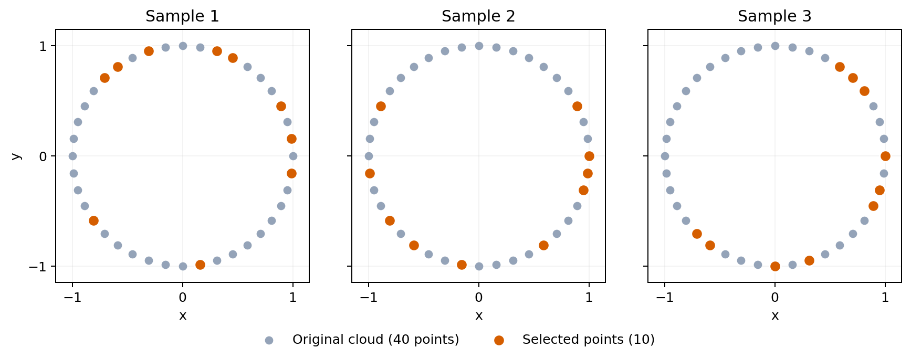
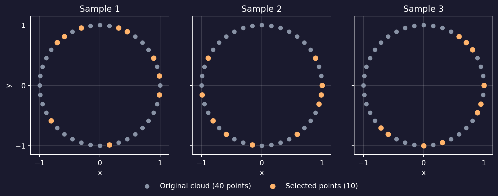
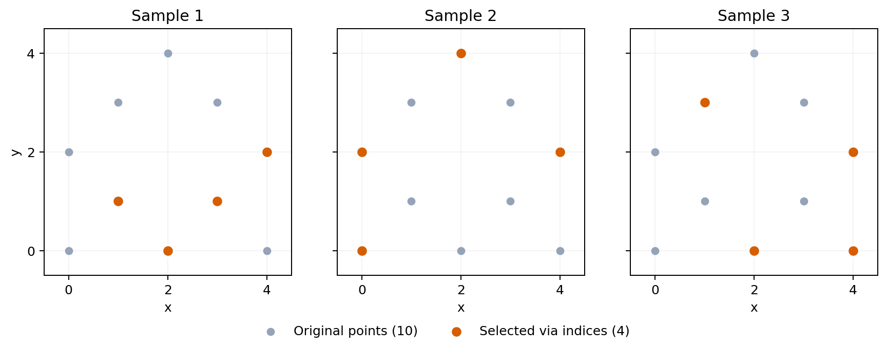
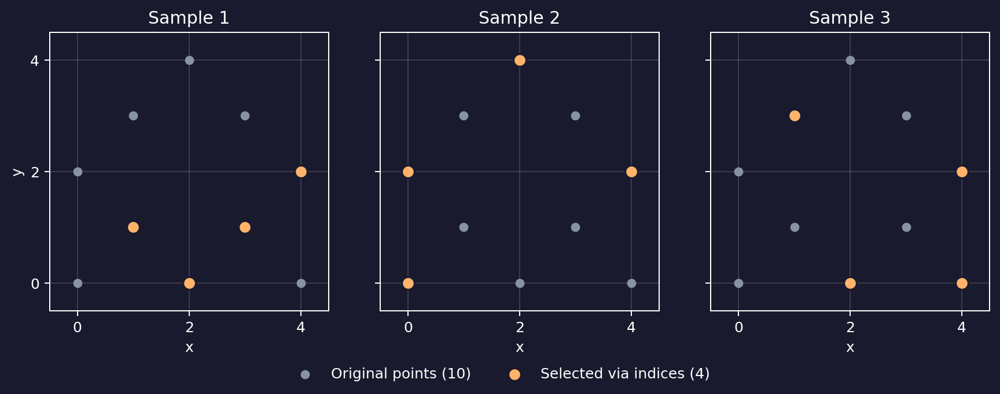

===================
Uniform subsampling
===================

:py:func:`~stablebear.random.subsample` draws one or more uniform
subsamples from a single :py:class:`~stablebear.point_cloud.PointCloud` or
:py:class:`~stablebear.distance_matrix.DistanceMatrix`, or from every value in a
:py:class:`~stablebear.point_cloud.PointCloudTensor` or
:py:class:`~stablebear.distance_matrix.DistanceMatrixTensor`. The result has
the same element family and precision. For a single cloud or matrix, it is a
tensor of shape ``(n_samples,)``; for a tensor input, a sample axis is appended
to its shape::

   import numpy as np
   import stablebear as sb

   cloud = sb.PointCloud(np.zeros((100, 3), dtype=np.float64))
   samples = sb.random.subsample(
       cloud,
       n_points=25,
       n_samples=8,
       generator=sb.random.Generator(seed=5),
   )

   assert samples.shape == (8,)
   assert samples[0].shape == (25, 3)

Point-cloud samples
===================

Each panel below shows the same 40 points, evenly spaced around a circle.
The point cloud is constructed without randomness; only the selections are random.
Ten points are selected without replacement in each sample and highlighted in
orange. Selections are independent
between samples, so a point can appear in more than one panel's selection.

.. dropdown:: Show code
   :color: secondary

   .. literalinclude:: _static/gen_subsampling_fig.py
      :language: python
      :start-after: docs snippet start point_cloud_subsamples --
      :end-before: docs snippet end point_cloud_subsamples --

Replacement and partial samples
===============================

By default, sampling is without replacement and a cloud with fewer than
``n_points`` raises ``ValueError``. Set ``allow_partial=True`` to use all
available points in random order instead. With ``replace=True``, repeated
draws are allowed; an empty input is accepted only when
``allow_partial=True``.

Duplicate removal
=================

Set ``discard_duplicates=True`` to keep only the first drawn occurrence of
each coordinate-identical point. Coordinates are compared with ordinary numeric
equality: signed zeros compare equal, infinities with the same sign compare
equal, and positive and negative infinity are distinct. NaN does not equal itself. Points
containing any NaN coordinate are therefore never discarded, even when the
same source point is drawn repeatedly. For distance matrices, it removes repeated
drawn source indices; distinct indices are retained even when their distance
is zero. Discarded points are not redrawn.

Inspecting selected indices
===========================

For indexed point-cloud and distance-matrix tensors, ``samples.indices``
returns an independent ``NestedTensor`` of uint64 selections. For example,
``samples.indices[0]`` gives the first sample's drawn source indices.
The selections follow the tensor's outer shape and view order; changing them
does not change the samples. Ordinary tensors, and indexed tensors whose
shared backing has been materialized by a write, return ``None``.

Input snapshots and mutation
============================

Each call copies each input cloud's current logical coordinates once. All
samples from that cloud share the fresh copy and store only row indices, so
later changes to the input do not affect the samples. Mutating an indexed
sample uses copy-on-write and does not affect sibling samples.

This also applies when resampling an indexed result or a view of one. The
sampler reads its selected rows directly and copies those logical coordinates
once into a fresh source, preserving their order and repetitions. The input
retains its indexed storage; the new result does not depend on the previous
result's coordinates or selections.

Distance-matrix samples
=======================

For a distance matrix ``M`` and sampled index sequence ``S``, the corresponding
result is the compressed symmetric principal submatrix ``M[S, S]``. Sampled
order and repetitions are preserved, including zero distance between two
occurrences of the same source index.

For example, start with distances between three vertices, numbered 0, 1, and 2::

   import numpy as np
   import stablebear as sb

   distances = np.array([
       [0., 3., 4.],
       [3., 0., 5.],
       [4., 5., 0.],
   ])
   matrix = sb.DistanceMatrix(distances)
   samples = sb.random.subsample(
       matrix, n_points=2, generator=sb.random.Generator(seed=5),
   )

   vertices = np.asarray(samples.indices[0])
   sampled_matrix = np.asarray(samples[0])

If the drawn vertices are ``[2, 0]``, the sample takes rows 2 and 0 **and**
columns 2 and 0, in that order. Its rows and columns now represent those two
vertices, and their distance is 4::

   # Matrix for the illustrative draw [2, 0]:
   [[0., 4.],
    [4., 0.]]

The actual draw is available in ``vertices``; these illustrative draws do not
assume a particular generator seed. To reconstruct any sample from the dense
input, select the same vertices on both axes::

   expected = distances[np.ix_(vertices, vertices)]
   np.testing.assert_array_equal(sampled_matrix, expected)

With ``replace=True``, a draw can repeat a vertex. For example, ``[2, 0, 2]``
produces this matrix::

   [[0., 4., 0.],
    [4., 0., 4.],
    [0., 4., 0.]]

The first and third rows represent the same original vertex, so their distance
is zero and their distances to every other sampled vertex agree. With
``discard_duplicates=True``, that draw becomes ``[2, 0]``, giving the 2×2
matrix above. Distinct vertices whose distance happens to be zero are retained.

Mapping sampled vertices back to points
---------------------------------------

If the matrix was computed from known points, ``samples.indices`` lets you
recover their coordinates from the original point array. Here we start with
10 explicit points and use SciPy's ``pdist`` to compute their pairwise
distances. ``DistanceMatrix`` accepts its condensed output directly::

   from scipy.spatial.distance import pdist

   points = np.array([
       [0., 0.],
       [2., 0.],
       [4., 0.],
       [1., 1.],
       [3., 1.],
       [0., 2.],
       [4., 2.],
       [1., 3.],
       [3., 3.],
       [2., 4.],
   ])
   matrix = sb.DistanceMatrix(pdist(points))
   samples = sb.random.subsample(
       matrix, n_points=4, n_samples=3,
       generator=sb.random.Generator(seed=5),
   )

   selected_points = points[samples.indices[0]]

``selected_points`` contains the original coordinates in the same order as
the first sampled matrix's rows and columns. Each panel below highlights the
four points recovered this way for one sample. Only the distance matrix is
passed to ``subsample``; the coordinates come from indexing ``points``.

.. dropdown:: Show code
   :color: secondary

   .. literalinclude:: _static/gen_subsampling_fig.py
      :language: python
      :start-after: docs snippet start distance_matrix_subsamples --
      :end-before: docs snippet end distance_matrix_subsamples --

Indexed results share one fresh copy of
the source matrix across its samples. Persistent homology and homological
kernel computations consume these logical matrices directly; mutation first
materializes the shared indexed state.
